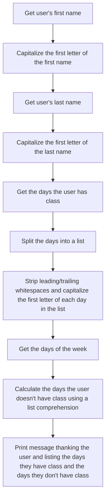

# Week 4 Hands On Psudocode
-----
* [File](module2.py)
* [Notes from hands on](HandsOn_Notes.ipynb)

You will develop a script which will take system arguments from the system. The system arguments will reflect all the days of the week and output that information along with the user’s name. 
## Psudocode
1. Get the user's first name
2. Capitalize the first letter of the first name
3. Get the user's last name
4. Capitalize the first letter of the last name
5. Get the days the user has class
6. Split the days into a list
7. Strip leading/trailing whitespaces and capitalize the first letter of each day in the list
8. Get the days of the week
9. Calculate the days the user doesn't have class using a list comprehension
10. Print a message thanking the user and listing the days they have class and the days they don't have class

Psudocode Flowchart
---------------
---------------

