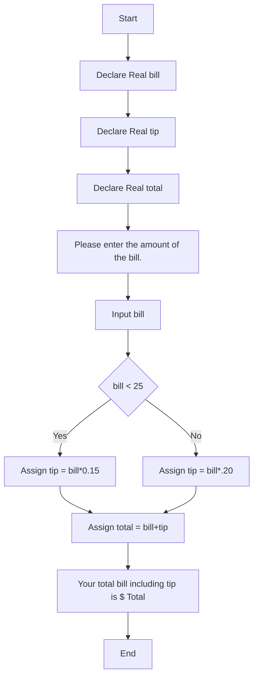

# Week 3 Hands On Project 1 Psudocode
-----

## Declare Variables
    Declare Real bill
    Declare Real tip
    Declare Real total
## Begin Program
    Output "Please enter the amount of the bill."
    Input bill
    If bill < 25
        Assign tip = bill*0.15
    Else
        Assign tip = bill*.20
    End
    Assign total = bill+tip
    Output "Your total bill including tip is $"&total
    End

Project 1 Psudocode Flowchart
---------------
---------------

