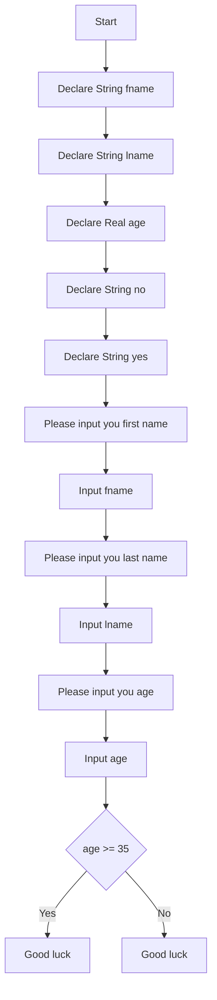

# Week 3 Hands On Project 3 Psudocode
-----
## Declare Variables
    Declare String fname
    Declare String lname
    Declare Real age
    Declare String no
    Declare String yes
## input First Name
    Output "Please input you first name"
    Input fname
## input Last Name
    Output "Please input you last name"
    Input lname
## input Age
    Output "Please input you age"
    Input age
## Assign yes and no
    Assign yes = "with running for president since you are"
    Assign no = "you are a too young to run for president since you are"
## if age is greater than or equal to 35
    If age>=35
        Output "Good luck "&fname &lname&yes&age
    Else
        Output "Good luck"&fname &lname &no &age
    End
    End

Project 3 Psudocode Flowchart
---------------
---------------

