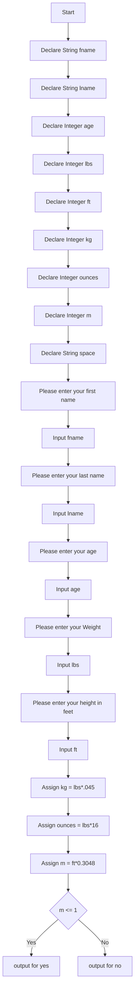

# Hands On Description
### Develop a script which asks the users for the following
1.  First Name
2.  Last Name
3.  Age
4.  Weight in pounds
5.  Height in feet
    -  You will convert the user’s weight in pounds to kilograms and ounces
        -   The conversions are as follows: 
            -   1 pound = .045 kilograms
            -   1 pound = 16 ounces
    - User’s height in feet to meters
        -   The conversion are as follows:
            -   1 foot = 0.3048 meters
- You will display the user’s full name, age, weight (in kilograms and ounces), and height (in meters) across the screen.

# Week 3 Hands On Project 3 Psudocode
-----

## Declare Variables
```psudocode
Declare String fname
Declare String lname
Declare Real age
Declare String no
Declare String yes
```
## input First Name
```psudocode
Output "Please input you first name"
Input fname
```     
## input Last Name
```psudocode
Output "Please input you last name"
Input lname
```
## input Age
```psudocode
    Output "Please input you age"
    Input age
```
## Assign yes
```psudocode
Assign yes = "with running for president since you are"
```
## Assign no
```psudocode
Assign no = "you are a too young to run for president since you are"
```
## if age is greater than or equal to 35
```psudocode
If age>=35
    Output "Good luck "&fname &lname&yes&age
Else
    Output "Good luck"&fname &lname &no &age
    End
```


Project 3 Psudocode Flowchart
---------------
---------------


## Output
----------------
```
Please enter your first name
    Nicholas
Please enter your last name
    Stull
Please enter your age
    20
Please enter your Weight
    20
Please enter your height in feet
    213
Thank you, Nicholas Stull. You are 21. You weigh 0 Kilograms, or 320 ounces. You are 64 meters tall.
```
