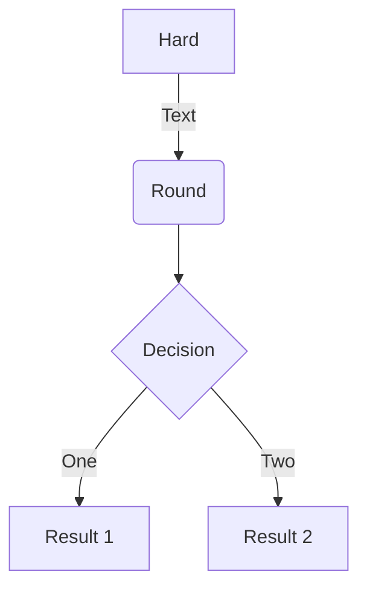

# Week 3 Notes
## Mermaid

To make a flowchart, you can use the mermaid extension.  You can use the following code to make a flowchart:

```mermaid
graph TD
A[Hard] -->|Text| B(Round)
B --> C{Decision}
C -->|One| D[Result 1]
C -->|Two| E[Result 2]
```

