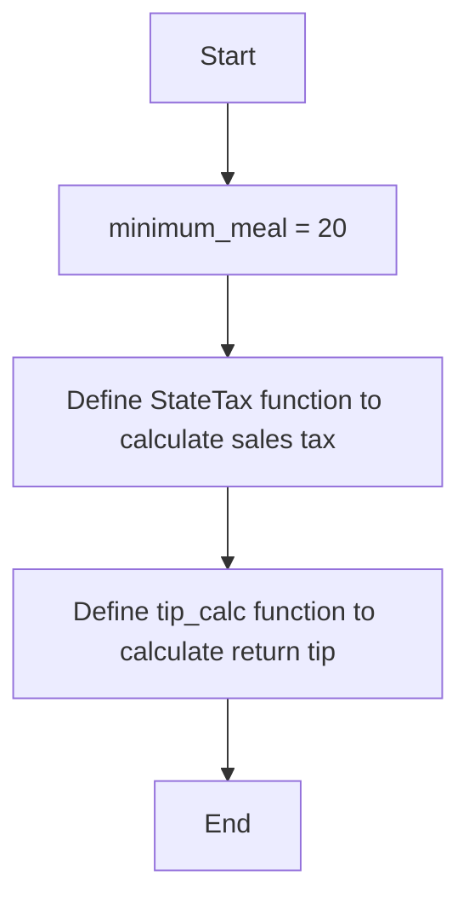

# Week 7

Tip_and_Tax.py
### Psuedo Code

```psuedo
#set variable for minimum_meal = 20
minimum_meal = 20

# define a function called StateTax to calculate 6% sales tax and return
function StateTax(price)
    sales_tax = 0.06 * price
    return sales_tax

# define a function called tip_calc to calculate the return tip
function tip_calc(grand_total)
    if grand_total >= minimum_meal
        gratuity = 0.2 * grand_total
    else
        gratuity = 0.15 * grand_total
    return gratuity

```

### Flowchart


Main_file.py
### Psuedo Code

```psuedo
# import StateTax and tip_calc functions from tax_and_tip module
from tax_and_tip import StateTax, tip_calc

# define main function to get user input and call display_results function
function main()
    name = get_input("Please enter customer name")
    price = get_input("Enter the price of the meal")
    display_results(name, price)

# define display_results function to calculate tax and tip, and display results
function display_results(name, price)
    tax = StateTax(price)
    grand_total = price + tax
    print("Customer name:", name)
    print("Original price is:", price)
    print("State tax is:", tax)
    print("Grand total is:", grand_total)
    gratuity = tip_calc(grand_total)
    print("Recommended gratuity is:", gratuity)

# call main function
main()
```

### Flowchart

```mermaid
graph TD
    start[Start] --> import[ StateTax and tip_calc]
    import --> main[get user input and display_results]
    main --> display[Define display_results function to calculate tax and tip, and display results]
    display --> e[End]
