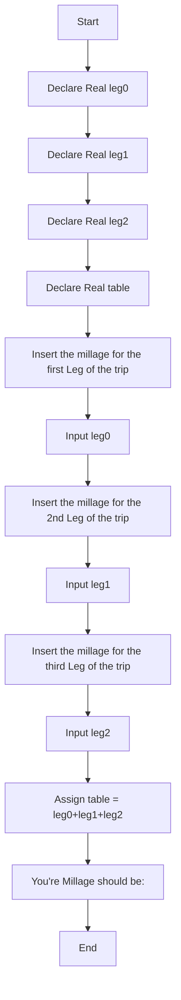

# Week 3 Hands On Project 2 Psudocode
-----

## Declare Variables
    Declare Real leg0
    Declare Real leg1
    Declare Real leg2
    Declare Real table
## Input 1st Leg of the trip
    Output "Insert the millage for the first Leg of the trip"
    Input leg0
## Input 2nd Leg of the trip
    Output "Insert the millage for the 2nd Leg of the trip"
    Input leg1
## Input 3rd Leg of the trip
    Output "Insert the millage for the third Leg of the trip"
    Input leg2
## Calculate the total millage
    Assign table = leg0+leg1+leg2
## Output the total millage
    Output "You're Millage should be:" &table

Project 2 Psudocode Flowchart
---------------

